# SideStep

SideStep is a small **macOS menu-bar app** that installs iOS apps onto your own
iPhone or iPad using your own Apple ID (a free one works). No jailbreak, no special
hardware.

<p align="center">
  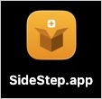
</p>

SideStep re-signs and reinstalls your apps in the background within Apple's allowed
7-day window, so they behave like a normal, permanently-installed app. It can do
this over Wi-Fi, with no cable — which makes putting an app on your own iPhone about
as easy as it already is on Android.

<p align="center">
  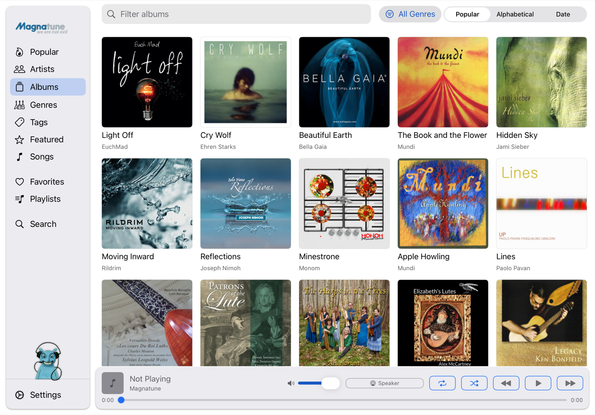<br>
  <em>A music app (Magnatune) installed on an iPad with SideStep, without the App Store.</em>
</p>

## What it's useful for

- **Installing apps the App Store doesn't carry** — open-source apps, your own
  apps, or apps with features Apple tends to reject (extensions, skins, scripting).
- **Keeping an old iPad or iPhone useful.** Apps the App Store has dropped for
  older devices can still be installed and kept running.
- **Shipping or receiving updates without a review queue.**
- **Staying local.** Your Apple ID, your Mac, your device. There's no SideStep
  account and no server — nothing is uploaded to anyone.

SideStep has a built-in catalog of legitimate, sideloadable apps you can search and
install directly:

<p align="center">
  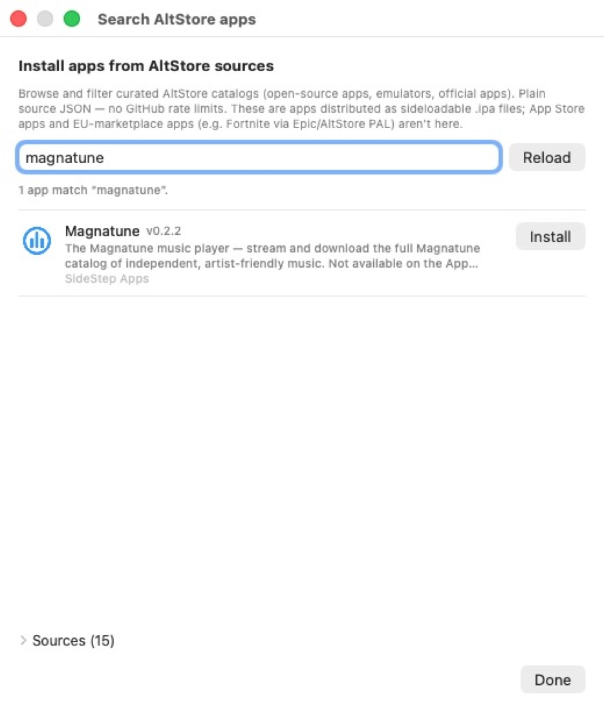
</p>

## Download

**[Download SideStep (notarized `.dmg`)](https://github.com/johnbuckman/SideStep/releases)** — macOS 14 (Sonoma) or newer, Apple Silicon.

Open the `.dmg` and drag **SideStep** to **Applications**. It's signed with an Apple
**Developer ID** and **notarized by Apple**, so it opens without the right-click /
"Open Anyway" step. SideStep runs in the menu bar — a small crate icon
,
with no Dock icon. Click it to open the panel below.

<p align="center">
  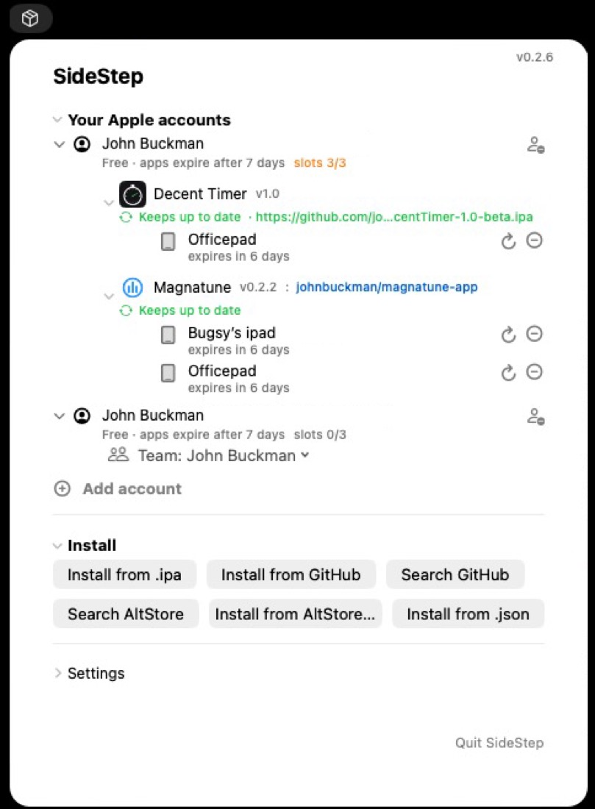
  <br>
  <em>The SideStep panel: your Apple accounts, the apps installed on each device, and options to add more.</em>
</p>

## Installing an app

1. **Install SideStep** on your Mac (above) and open it.
2. **Sign in** with an Apple ID. Any will do — you can make a free one at
   [icloud.com](https://icloud.com). SideStep handles the login and the
   texted/2-factor code.
3. **Connect your iPhone or iPad** to your Mac by cable and tap **Trust** if asked.
4. **Turn on Developer Mode** on the device (Settings ▸ Privacy & Security ▸
   Developer Mode → on → it restarts once). SideStep walks you through this if it's
   off.
5. In SideStep, click **Search AltStore**, type what you want (try "magnatune" or
   "timer"), and click **Install** — or point SideStep at any `.ipa` file.
6. **Trust your Apple ID as a developer, once.** The first time you install from a
   given Apple ID, the device asks you to approve it: Settings ▸ General ▸ VPN &
   Device Management ▸ tap your Apple ID ▸ Trust. Every app you install from that
   same account afterwards is trusted automatically.

<p align="center">
  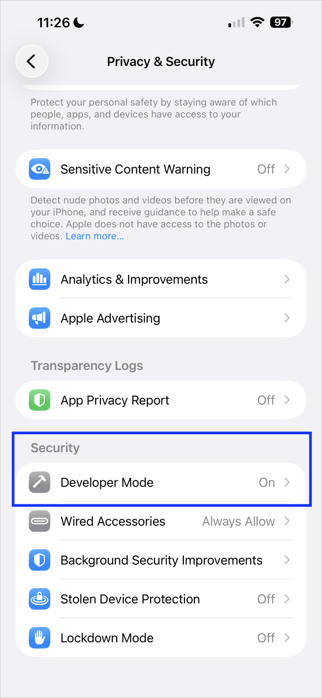
  &nbsp;&nbsp;
  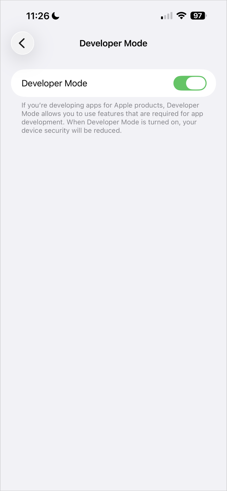
  <br>
  <em>Step 4 — Settings ▸ Privacy &amp; Security ▸ Developer Mode, then switch it on (the device restarts once).</em>
</p>

<p align="center">
  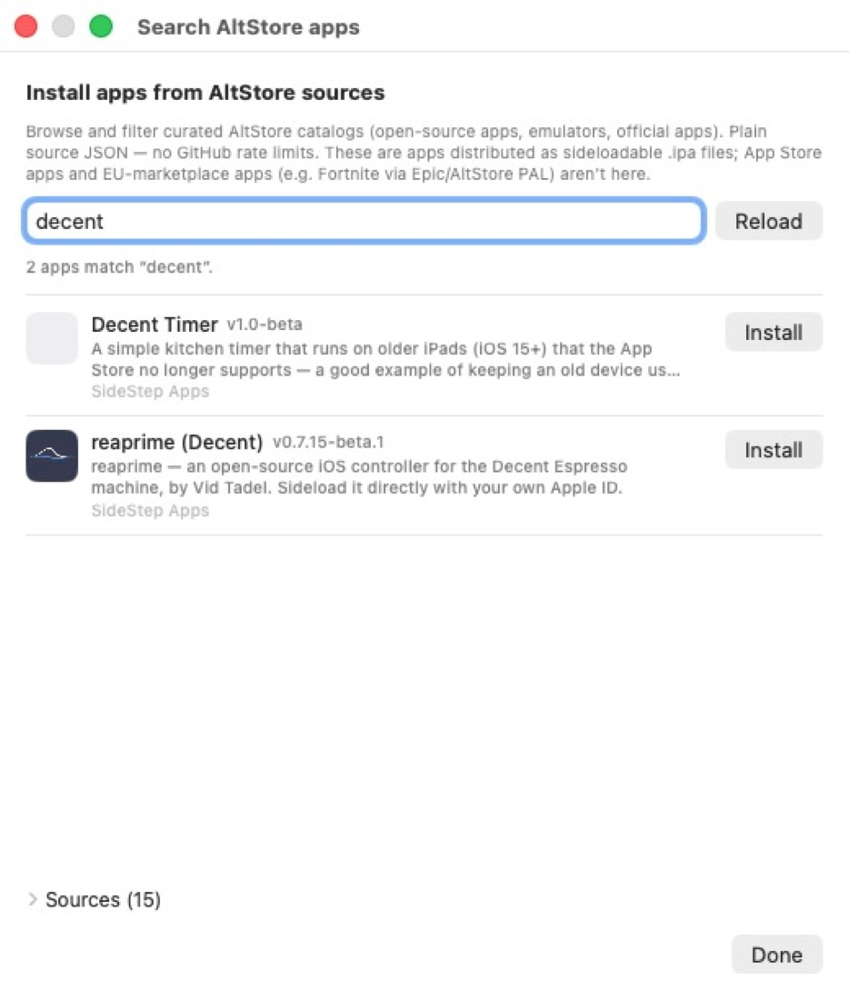
  <br>
  <em>Step 5 — search the catalog and click Install.</em>
</p>

<p align="center">
  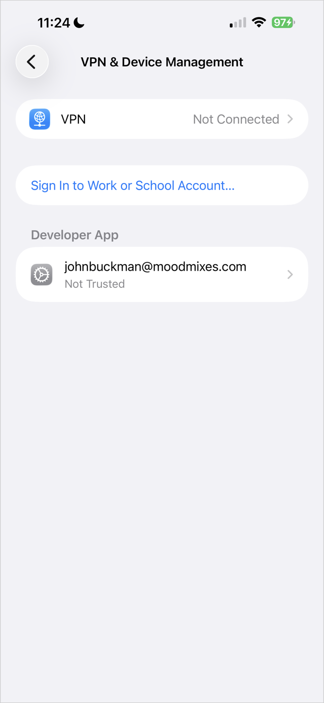
  &nbsp;
  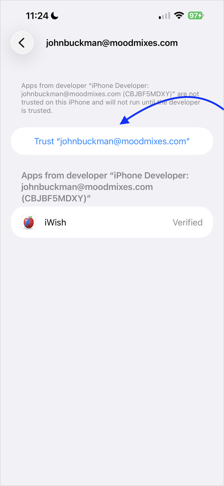
  &nbsp;
  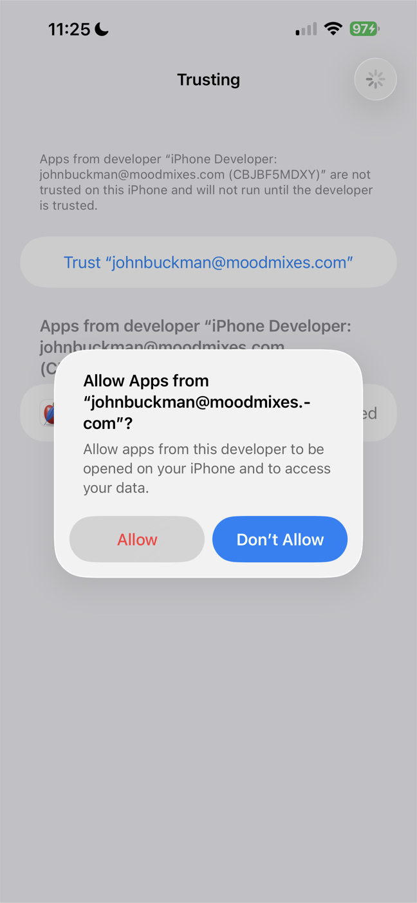
  &nbsp;
  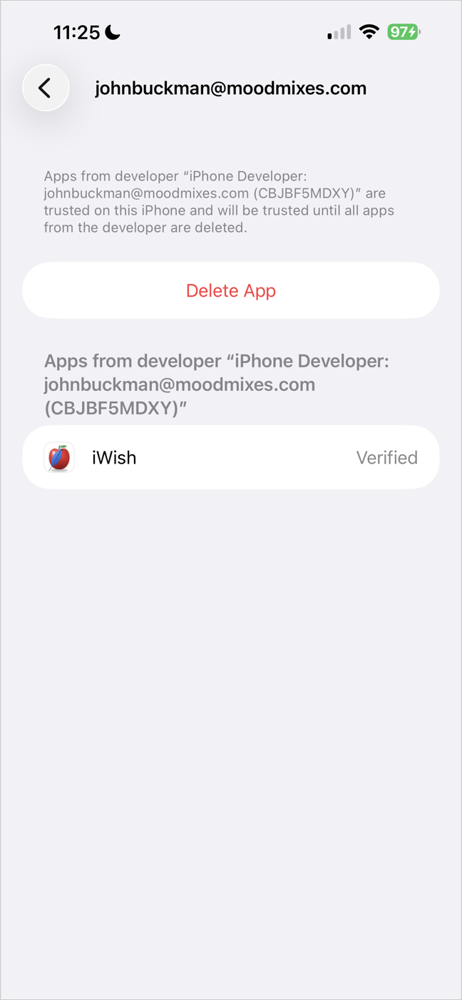
  <br>
  <em>Step 6 (first time only) — Settings ▸ General ▸ VPN &amp; Device Management ▸ tap your Apple ID ▸ <strong>Trust</strong> ▸ <strong>Allow</strong>. It then shows as Verified.</em>
</p>

After the first install, adding more apps works over Wi-Fi: as long as the device
is on and unlocked, you don't need to plug it in.

<p align="center">
  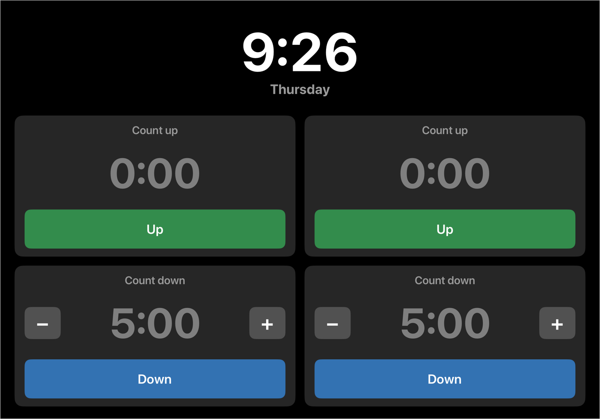
  &nbsp;&nbsp;
  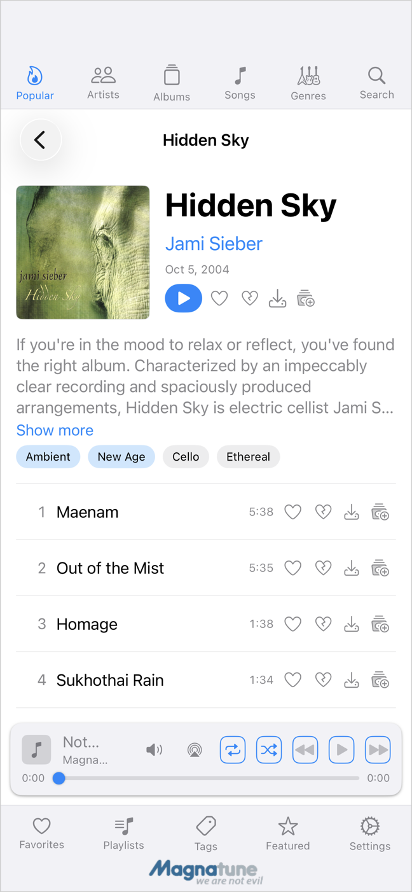
  <br>
  <em>Apps installed with SideStep — a kitchen timer on an iPad, a music player on an iPhone.</em>
</p>

## Give your users a one-click installer

**SideStep Wizard** lets an app developer hand anyone a single file that installs their app — no Xcode and no developer account on the other end. You point it at your app's GitHub repo once, and it produces a small **"‹name› installer"** you can send to people or link from your website.

Try it — this button installs **Magnatune** (a music player) with SideStep:

<p align="center">
  <span class="sidestep-install" data-repo="johnbuckman/magnatune-app"
        data-installer="https://github.com/johnbuckman/magnatune-app/releases/latest/download/magnatune-app-installer.zip"></span>
</p>
<script>
(function () {
  function mount(el){
    var repo=el.getAttribute("data-repo"); if(!repo) return;
    var dl=el.getAttribute("data-installer")||"";
    var app=el.getAttribute("data-app")||repo.split("/").pop();
    var btn=document.createElement("a");
    btn.textContent="Install "+app+" with SideStep";
    btn.href="sidestep://install?repo="+encodeURIComponent(repo);
    btn.style.cssText="display:inline-block;padding:12px 22px;border-radius:10px;background:#0a84ff;color:#fff;font-weight:600;text-decoration:none;cursor:pointer;";
    var note=document.createElement("div"); note.style.cssText="margin-top:10px;font-size:14px;opacity:.75;"; note.style.display="none";
    var downloaded=false;
    function download(){ if(!dl) return; var a=document.createElement("a"); a.href=dl; a.setAttribute("download",""); document.body.appendChild(a); a.click(); document.body.removeChild(a); }
    btn.addEventListener("click",function(){
      if(downloaded) return;
      var launched=false; function mark(){launched=true;}
      window.addEventListener("blur",mark,{once:true});
      document.addEventListener("visibilitychange",function vc(){if(document.hidden){launched=true;document.removeEventListener("visibilitychange",vc);}});
      setTimeout(function(){
        window.removeEventListener("blur",mark);
        if(launched) return;
        if(!dl){ note.textContent="Install SideStep first, then click again."; note.style.display="block"; return; }
        download();
        downloaded=true; btn.href=dl; btn.setAttribute("download","");
        btn.textContent="Run the "+app+" installer now";
        note.textContent="It’s going to your Downloads folder now.";
        note.style.display="block";
      },1500);
    });
    el.appendChild(btn); el.appendChild(note);
  }
  function init(){document.querySelectorAll(".sidestep-install").forEach(mount);}
  if(document.readyState==="loading") document.addEventListener("DOMContentLoaded",init); else init();
})();
</script>

*If you already have SideStep, the button opens it straight to Magnatune — tap Install. If not, it offers the Magnatune installer, which installs SideStep first and walks you through the setup.*

### Make your own installer

1. **[Download SideStep Wizard](https://github.com/johnbuckman/SideStepWizard/releases/latest/download/SideStepWizard.dmg)** (notarized `.dmg`) and open it.
2. Type a short **tiny name** for your app. As you type it checks `tinyurl.com/‹name›`: if it already points to your GitHub repo it's reused; if not, click **Create it for me** and enter your repo (the one whose Releases hold your `.ipa`) — it registers the short link for you.
3. Click **Create Installer**. A file named **‹name› installer** lands on your Desktop, along with ready-to-paste website HTML for a button like the one above.

The installer is the same signed, notarized app, just renamed — so it opens with no Gatekeeper warning. It bundles no copy of SideStep; it **downloads the latest SideStep** at run time, so nobody is stuck on a stale version. Host it wherever you like — for example, as a Release asset on your app's repo — and point the website button at it.

## Automatic updates

Every app SideStep installs carries a small piece of code called a **beacon**. When
you open the app, it tells your Mac that the device is present and unlocked. If a
newer version of the app exists, your Mac signs it and sends it to the device over
Wi-Fi in the background; the app applies the update the next time you close and
reopen it. No cable, no prompts, no App Store.

This is what keeps a sideloaded app from expiring: instead of dying after a week and
needing a manual reinstall, it stays signed and current on its own.

### Checking on an app: the two-finger gesture

Every app SideStep installs has a hidden status panel. To open it, **press and hold
two fingers in any two corners of the screen at the same time** (for example,
top-left and top-right) **for about 1.5 seconds.** It's an awkward gesture on
purpose, so you won't trigger it by accident.

The panel shows which Apple ID signed the app, when it was last refreshed, when the
signature expires, and an **Update app now** button.

<p align="center">
  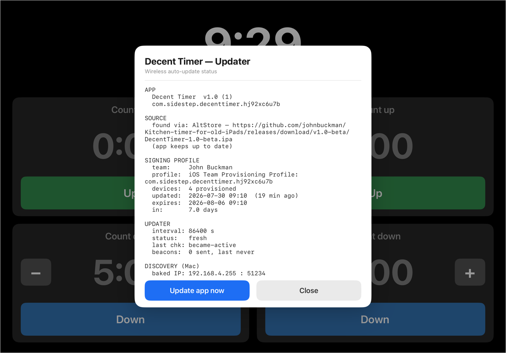
  <br>
  <em>The status panel — hold two fingers in two corners for about 1.5 seconds to open it.</em>
</p>

## Why I built it

I make espresso machines, and our software is written in Tcl/Tk — a language the App
Store won't accept. To get our app onto customers' iPads I needed a way to sideload
it and keep it updated without asking every customer to plug into a Mac each week.
SideStep is the result. It works just as well for any app you want on your own
device without going through the Store.

<p align="center">
  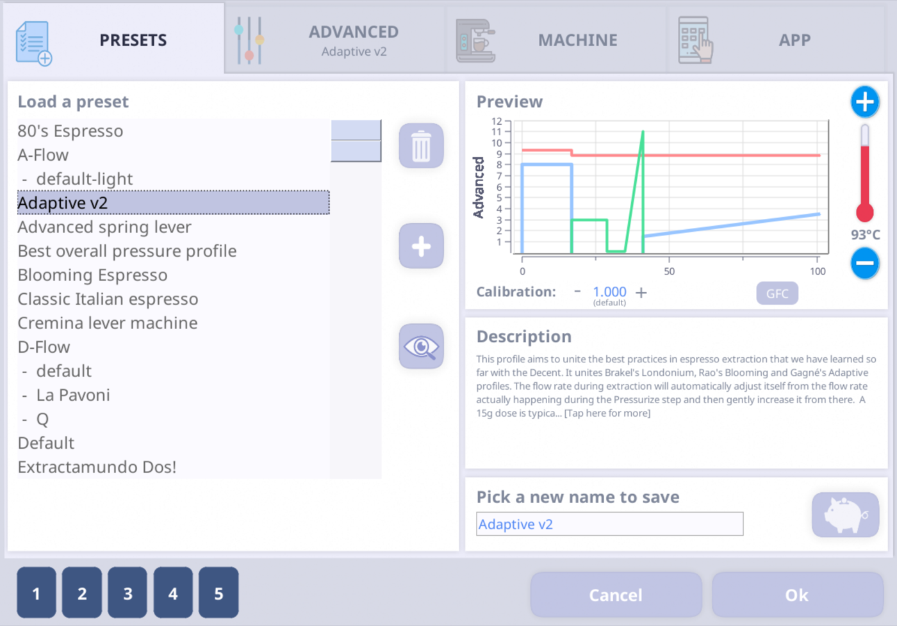
  <br>
  <em>The de1app, our espresso-machine control app, on an iPad — coming soon via SideStep.</em>
</p>

To make that work I ported Tcl/Tk to iOS. Below is that environment (iWish) running
on an iPad and talking to Bluetooth hardware.

<p align="center">
  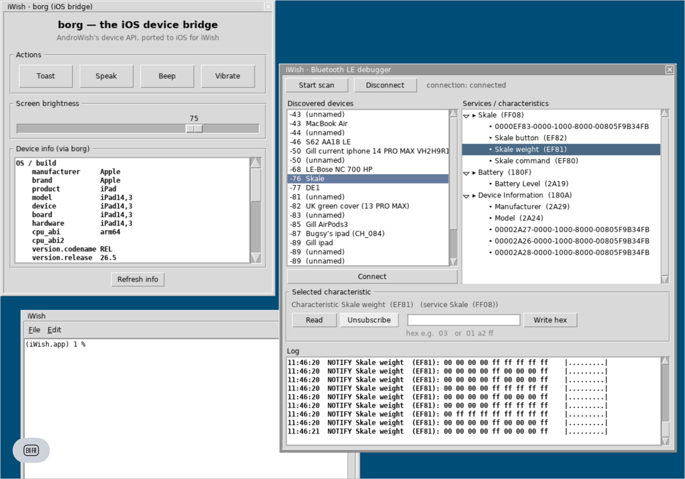
</p>

## How it works

- **It uses Apple's own signing.** Apple lets anyone register as a free developer
  with their existing Apple ID. SideStep logs in, obtains a normal development
  certificate and provisioning profile (the same ones Xcode uses), and signs the app
  with them. It does not jailbreak, patch iOS, disable any security, or remove any
  DRM — the device runs the app because Apple's own signature permits it.
- **It installs over the standard protocol** Apple's own tools use (`lockdown` /
  `usbmux`), via the open-source
  [libimobiledevice](https://github.com/libimobiledevice/libimobiledevice).
- **It re-signs before expiry** — on a timer, when you plug a device in, and (near
  expiry) every few minutes until the device is reachable over USB or Wi-Fi. It
  launches at login, so this happens without attention.
- **There's nothing central to shut off.** No server, no shared certificate — each
  app is signed by your Apple ID for your device. The Mac app is open source and
  Apple-notarized.

## If your app does expire

Apple's free signatures last 7 days, and SideStep normally re-signs your apps well
before then, in the background. But if a device is switched off or off the network
for longer than that — for example an iPad that runs out of battery and sits unused
for a couple of weeks — its apps' signatures can lapse, and those apps won't open
until they're re-signed.

Getting them back is quick:

1. Turn the iPad on, **unlock it**, and make sure it's on the same Wi-Fi as your Mac
   (or plug it in).
2. Open SideStep and click the **refresh** button next to the app on that device.

SideStep re-signs the app with a fresh 7-day signature and reinstalls it over Wi-Fi —
no cable needed, as long as the device is unlocked and reachable. Nothing has to be
deleted or set up again: Developer Mode and the trust from the first install still
apply, and SideStep signs you back in on its own if your login has lapsed.

If several apps on that device expired, you only have to do this once — tapping
refresh on one expired app **automatically refreshes the other expired apps on the
same device too.**

## If you turn Developer Mode off

SideStep-installed apps only run while **Developer Mode** is on. If you turn Developer
Mode off, those apps will stop opening until you turn it back on. To re-enable them:

1. Turn **Developer Mode** back on (Settings ▸ Privacy & Security ▸ Developer Mode)
   and let the device **restart**.
2. On the iPad, **trust your Apple ID again** (Settings ▸ General ▸ VPN & Device
   Management ▸ tap your Apple ID ▸ Trust).

After that, your sideloaded apps open normally again.

## SideStep is not for piracy

SideStep exists for one reason: to install **legitimate open-source and
self-published apps** — the kind Apple's Store won't carry, like our own
espresso-machine software. It is not a way to install cracked copies of paid App
Store apps, and it actively works to stay that way:

- **The catalog is curated.** SideStep's built-in sources list only legitimate apps
  — open-source projects, emulators, and official app repositories. Sources are
  added by public pull request and reviewed first; no cracked or "tweaked" App Store
  apps are accepted.
- **It refuses known pirate sources.** SideStep carries a blocklist of sources known
  to hand out cracked apps and won't add them — whether from the catalog or from a
  URL you paste in.
- **It fingerprints apps before installing.** If an app matches a known pirated
  build, SideStep refuses it.
- **It asks before installing a paid App Store app.** If what you're installing
  looks like a paid App Store title, SideStep stops and asks you to confirm you have
  the right to it. A legitimate owner can continue; casual piracy is refused rather
  than waved through.

The blocklist is public and updated from the repository, so it can grow as new
pirate sources turn up. The point is to keep SideStep useful for the independent and
open-source apps it was built for — and not much use for anything else.

## Build

```
swift build --product InstallerApp   # the menu-bar app
swift build --product Provision       # the command-line tool (install / refresh)
```

`./bundle-app.sh` builds and bundles the menu-bar app into `SideStep.app`. The
device tools (a small [libimobiledevice](https://github.com/libimobiledevice/libimobiledevice)
helper in [`Helpers/idevice`](Helpers)) ship inside the app, so it's self-contained
— no Python or external tools required at runtime.

Contributing, or an AI agent picking up the project? Start with
[`docs/AI-BOOTSTRAP.md`](docs/AI-BOOTSTRAP.md), then
[`docs/CURRENT-STATE.md`](docs/CURRENT-STATE.md).

## Credits & license

Built on **[AltSign]** from the **[AltStore]** / **[SideStore]** projects (© Riley
Testut and contributors), licensed **AGPL-3.0**. As a derivative work, SideStep is
likewise licensed under the **GNU Affero General Public License v3.0** — see
[`LICENSE`](LICENSE). The signer is **[zsign]** by zhlynn, included under the **MIT
License** (see [`Dependencies/zsign`](Dependencies/zsign)).

[AltSign]: https://github.com/SideStore/AltSign
[AltStore]: https://github.com/altstoreio/AltStore
[SideStore]: https://github.com/SideStore/SideStore
[zsign]: https://github.com/zhlynn/zsign
