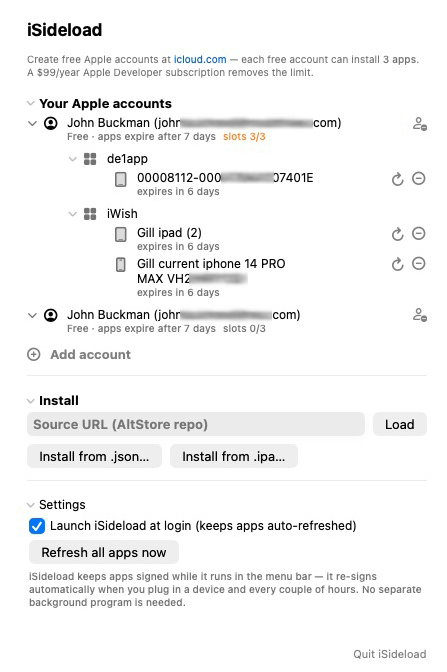

# SideStep

A small **macOS menu-bar app** that installs and keeps iOS apps signed on your
devices using a **free Apple ID** — a lean, self-contained alternative to
AltStore/SideStore that signs on the Mac.

> **⏱ [Read the TL;DR first](docs/TLDR.md)** — who can sideload what, and how (end users
> and developers, free vs paid, USB vs QR). Two minutes, saves confusion.

> **New to sideloading?** Read the **[full step-by-step guide](docs/GUIDE.md)** —
> what to do on your iPhone/iPad, what to download, and the real benefits & limits.

> **Contributing, or an AI picking up this project?** Start with
> **[docs/AI-BOOTSTRAP.md](docs/AI-BOOTSTRAP.md)** for a fast orientation, then
> **[docs/CURRENT-STATE.md](docs/CURRENT-STATE.md)** — the living state of the
> wireless install/QR/progress/device-registration work, including build gotchas,
> the ad-hoc signing recipe, and what to pick up next. See
> **[docs/wireless/](docs/wireless/)** for the original network research.

## Download

**[⬇︎ SideStep Beta 0.2.2 (notarized `.dmg`)](https://github.com/johnbuckman/SideStep/releases/tag/v0.2.2)** — macOS 14 (Sonoma) or newer, Apple Silicon.

Open the `.dmg` and drag **SideStep** to **Applications**. It's signed with a
Developer ID and notarized by Apple, so it opens normally — no right-click /
"Open Anyway" dance. SideStep runs in the **menu bar** (no Dock icon); click the
crate icon to open the panel. This is a **beta** — expect rough edges.

## Presentation

A slide overview of SideStep — current state, how USB install works, the
multi-Apple-ID and $99 paid-account benefits, the menu-bar UI, and the
work-in-progress Wi-Fi updating — is in [`docs/`](docs):

- **[SideStep.pdf](docs/SideStep.pdf)** — view in any browser
- **[SideStep.pptx](docs/SideStep.pptx)** — editable PowerPoint

## What it does

- **Sign in with one or more Apple IDs** (free or paid). Login, 2-factor
  (including SMS for accounts with no trusted device), and the Apple developer
  provisioning are all handled for you.
- **Pick which team to sign with.** If an Apple ID belongs to more than one
  developer team (e.g. a personal free team *and* a paid company team), SideStep
  shows a per-account **Team** menu so you choose — a free team gives 7-day
  installs, a paid team gives 1-year. It never touches other developers'
  certificates on a paid team.
- **Install** an app from an AltStore-format **source URL**, a local **`.json`**
  catalog, or a single **`.ipa` / `.app`** file.
- Apps are signed with a **SHA-256 CodeDirectory via [zsign]** (the format iOS
  16–26 accept) using Apple's `codesign`-equivalent path, then installed over the
  lockdown/`usbmux` protocol.
- **Keeps apps alive** with no separate background program: SideStep re-signs and
  reinstalls before the 7-day free-provisioning expiry — on a timer, the moment you
  plug a device in, and (near expiry) by re-checking **every 5 minutes** and pushing
  as soon as the device is reachable over USB or Wi-Fi. It **launches at login by
  default** so this happens unattended.
- **Manage everything from the menu bar**: multiple accounts (each free ID gives
  3 app slots, shown as a live `slots N/3`), grouped by account → app → device with
  collapsible sections and a panel that **auto-sizes to its contents**. Each device
  row has a circular-arrow **Refresh** (re-sign + reinstall now) and a **–** that
  uninstalls the app and frees its slot.

Free Apple IDs (create one at <https://icloud.com>) can install **3 apps**; a
$99/year Apple Developer subscription removes that limit and extends signing to
one year.

## New in Beta 0.1

- **Wireless install over Wi-Fi.** SideStep installs (and re-signs) to a device
  over Wi-Fi with no cable — no jailbreak, no VPN. The breakthrough was answering
  the device's **heartbeat** (`com.apple.mobile.heartbeat` Marco/Polo pings); without
  it iOS resets the AFC upload connection over Wi-Fi (the old "AFC error 34"). Install
  is now **synchronous** (a stray async callback used to false-report success) and
  streams a live **% + ETA** as the app uploads.
- **Self-updating apps (built-in beacon).** Every app SideStep installs is
  automatically instrumented with a tiny **beacon**. When the app runs it tells your
  Mac "I'm unlocked and ready"; the Mac re-signs the newest build and pushes it back
  over Wi-Fi — so a sideloaded app can **update itself** without the Mac and device
  being tethered.
  The beacon also registers for periodic background wake and refreshes when stale.
  The Mac side is native (a built-in `_sidestep._udp` Bonjour listener), so there's
  still nothing external to run.
- **One dialog to install.** Choosing an `.ipa` goes straight to a single
  **"Do you want to install X?"** dialog listing every connected device — each
  labeled **USB** or **Wi-Fi** and with its **Developer Mode** state. The device you
  pick decides the transport; over-the-air-capable builds also offer a **QR code**
  right there.
- **Developer Mode help that's honest about iOS's limits.** For a device with
  Developer Mode off, SideStep reveals the Settings row and — on a device with no
  passcode — can **arm** Developer Mode so iOS reboots into it. (iOS lets no app open
  or navigate the on-device Settings app, so with a passcode set it shows short
  manual steps instead.)
- **One-time trust hint.** The first install from a given Apple ID shows the
  one-time "trust this developer" step; installs from that account afterwards stay
  quiet.
- **Developer Mode detection over USB** and a **Debug Log** window (menu → *Show
  Debug Log*, savable to a text file), plus a crash-safe `/tmp/sidestep.log` that
  captures startup even if the app dies early.
- **SideStep updates itself.** A daily GitHub-Releases check (and a **Check for
  Updates…** button) downloads a newer notarized build, verifies it is signed by
  our Developer ID team (`spctl --assess` + a `TeamIdentifier` pin), swaps the app
  bundle on quit, and relaunches — no Sparkle, no server.

## Build

```
swift build --product InstallerApp     # the menu-bar app
swift build --product Provision         # the CLI (install / refresh)
```

`./bundle-app.sh` builds and bundles the menu-bar app into `SideStep.app`. The
device tools (a small [libimobiledevice](https://github.com/libimobiledevice/libimobiledevice)
helper in [`Helpers/idevice`](Helpers)) are bundled in the app, so it's
**self-contained** — no Python or external tools required at runtime.

## Credits & license

Built on **[AltSign]** from the **[AltStore]** / **[SideStore]** projects
(© Riley Testut and contributors), which are licensed **AGPL-3.0**. Because this
is a derivative work, SideStep is likewise licensed under the **GNU Affero
General Public License v3.0** — see [`LICENSE`](LICENSE).

The signer is **[zsign]** by zhlynn, included under the **MIT License**
(see [`Dependencies/zsign`](Dependencies/zsign)).

App screenshot:



[AltSign]: https://github.com/SideStore/AltSign
[AltStore]: https://github.com/altstoreio/AltStore
[SideStore]: https://github.com/SideStore/SideStore
[zsign]: https://github.com/zhlynn/zsign
